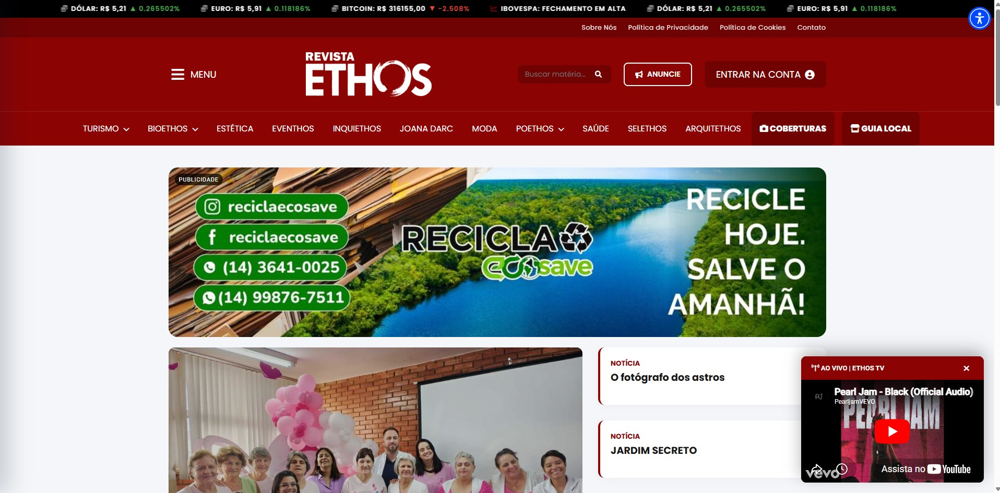
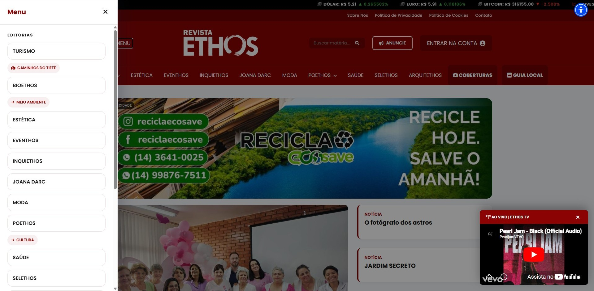
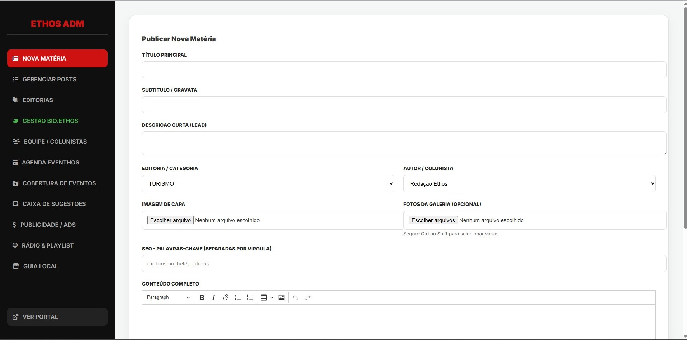
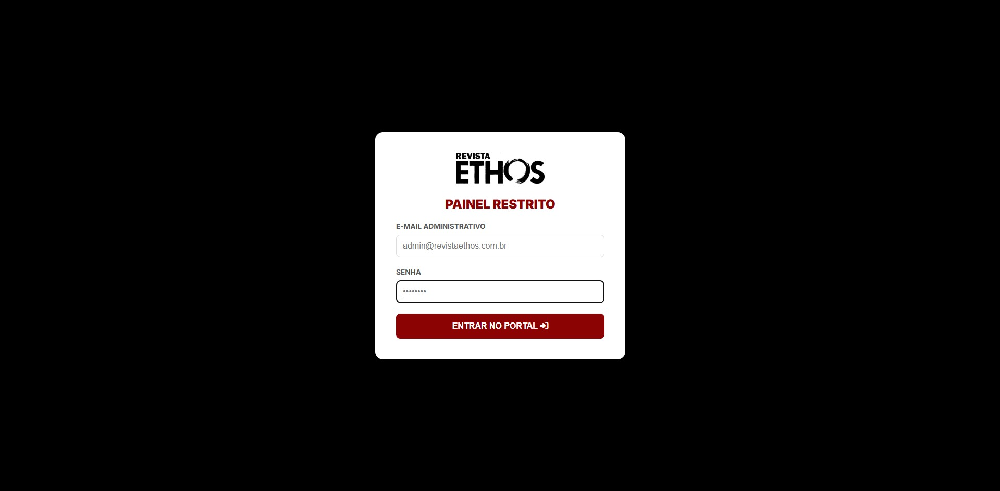
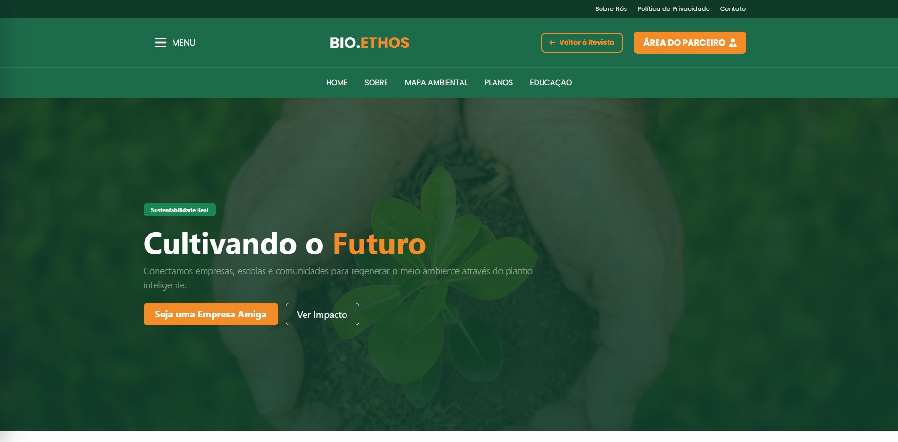
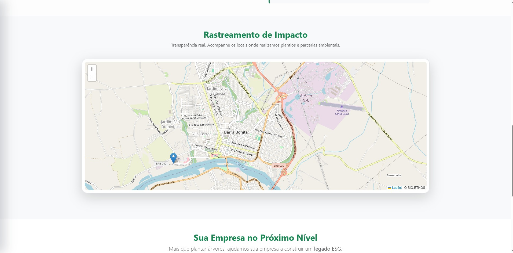

# Portal Ethos
Interface e Estrutura de Gestão de Conteúdo Web

Repositório de demonstração contendo a estrutura de front-end e a arquitetura de arquivos do Portal Ethos. Por motivos de segurança e proteção de dados, as rotas de back-end, lógicas de autenticação e conexões com o banco de dados foram isoladas e omitidas desta versão pública.

---

### Acesso em Produção
Você pode visualizar a aplicação em funcionamento através do link abaixo:
[Acessar Portal ETHOS](https://revistaethos.net.br/)

---

### Tecnologias Aplicadas

* **Linguagem:** PHP 
* **Banco de Dados:** MySQL (Lógica isolada)
* **Front-end:** HTML5, CSS3, JavaScript
* **Arquitetura:** MVC simplificado e modular (Includes)

---

### Visualização do Sistema

#### 1. Interface Pública
Apresentação voltada para a experiência do usuário, priorizando carregamento rápido, responsividade e leitura clara.

#### 2. Painel Administrativo (Back-end)
Área restrita desenvolvida para gerenciamento completo do portal (CRUD de notícias, gerenciamento de pautas, controle de publicidade e estatísticas).

#### 3. Landing Page: Bio.Ethos
Página exclusiva (One Page) integrada à editoria de Meio Ambiente. Desenvolvida para apresentar a iniciativa ambiental do portal.

---

### Destaques do Projeto

* **Módulo Bio.Ethos:** Desenvolvimento de uma Landing Page focada em sustentabilidade, contendo apresentação institucional e mapa interativo de atuação.
* **Painel de Gestão Personalizado:** Sistema completo construído do zero para suprir as necessidades específicas da redação.
* **Acessibilidade e Integrações:** Implementação de recursos inclusivos, consumo de APIs (cotação de moedas em tempo real) e players de transmissão via YouTube.
* **Design Profissional:** Foco na usabilidade e harmonia visual, garantindo uma interface sofisticada e de fácil navegação.
* **Gestão de Publicidade:** Módulos integrados para controle de banners e espaços publicitários.
